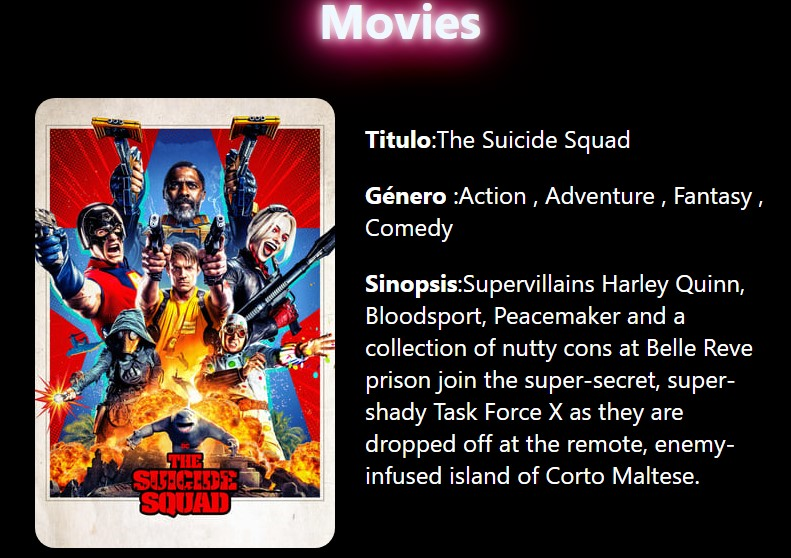

<h3>Web de peliculas con buscador.</h3>

Proyecto final de curso de React Js,practica de hooks ,routing,formularios,props,CSS Grid y flex,Apis y más.

La estructura de las carpetas es: Componentes, para los componentes con sus respectivos módulos de css,dentro también está helpers que contiene la función que hace la petición a la api y hooks que contiene el hook useQuery.Por otro lado está Pages para la página de los detalles de la película. 

Cuatro componentes:
<ul>
  <li>MovieCard:para la tarjeta de cada pelicula. </li>
  <li>MoviesGrid:para estructurar la grilla de los posters de las peliculas.</li>
  <li>Search:para el formulario de busqueda.</li>
  <li>Spinner:el spinner de carga.</li>
</ul>

La interfáz de las imágenes de las peliculas la hice con Css Grid,donde cada película es un item y para las columnas grid-template-columns con la función de repetir y auto-fill para que se generen columnas de manera automática con un ancho determinado.Para la separacion entre imágenes usé gap.

Para mostrarlas desde los datos de la api ,usé el metodo map para qué, por cada objeto del arreglo muestre una fila de una lista.

